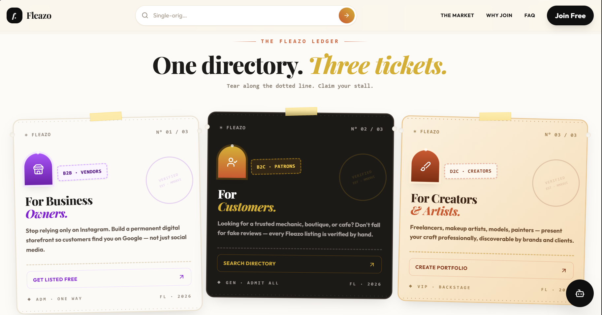

<!-- Washi Tape Decorative Header -->
<div style="height: 12px; background: repeating-linear-gradient(135deg, #D4AF37 0 8px, #C85A32 8px 16px); border-radius: 4px; margin-bottom: 20px; box-shadow: 0 2px 8px rgba(0,0,0,0.1);"></div>

<div align="center" style="background-color: #FDFBF7; border: 2px solid #EBE4D5; border-radius: 16px; padding: 32px; margin-bottom: 30px; box-shadow: 0 10px 30px -10px rgba(45,40,37,0.15); position: relative; overflow: hidden;">
  <!-- Dotted Canvas Pattern Simulation in SVG -->
  <div style="position: absolute; inset: 0; opacity: 0.15; pointer-events: none; background-image: radial-gradient(#C85A32 1.5px, transparent 1.5px); background-size: 24px 24px;"></div>

  <h1 style="font-family: 'Playfair Display', serif; font-weight: 900; font-size: 3rem; color: #0F0F0F; margin: 0 0 10px 0; letter-spacing: -0.03em;">Fleazo</h1>

  <div style="display: flex; gap: 8px; justify-content: center; flex-wrap: wrap; margin-bottom: 20px;">
    
    
    
    
    
  </div>

  <p style="font-family: 'Outfit', sans-serif; font-size: 16px; color: #2D2825; max-width: 600px; margin: 0 auto 10px auto; font-weight: 500; line-height: 1.6;">
    An AI-Ready Local Directory & Discovery Network connecting verified local businesses, creators, and freelancers across India — with zero platform cuts, commissions, or middle-men.
  </p>
  
  <p style="font-family: 'Playfair Display', serif; font-style: italic; font-size: 14px; color: #C85A32; margin: 0;">
    Hand-picked. Vetted. Outside the algorithm.
  </p>
</div>

---

## <svg width="20" height="20" viewBox="0 0 24 24" fill="none" stroke="currentColor" stroke-width="2" stroke-linecap="round" stroke-linejoin="round" style="vertical-align: middle; margin-right: 8px; display: inline-block; color: #C85A32;"><path d="M12 22C17.5228 22 22 17.5228 22 12C22 6.47715 17.5228 2 12 2C6.47715 2 2 6.47715 2 12C2 14.7255 3.09032 17.1962 4.85857 19C5.03458 19.176 5.0999 19.437 5.02108 19.6734L4.83333 20.2366C4.6974 20.6444 5.0227 21.0556 5.45263 21.0024L6.96024 20.8163C7.16834 20.7906 7.37525 20.8711 7.50974 21.0298C8.79025 21.6542 10.3275 22 12 22Z"/><circle cx="7.5" cy="10.5" r="1.5" fill="currentColor"/><circle cx="11.5" cy="7.5" r="1.5" fill="currentColor"/><circle cx="16.5" cy="9.5" r="1.5" fill="currentColor"/><circle cx="15.5" cy="14.5" r="1.5" fill="currentColor"/></svg> Visual Identity & Design System

<div align="center" style="background-color: #F9F6F0; padding: 24px; border-radius: 16px; border: 1px solid #EBE4D5; box-shadow: inset 0 0 30px rgba(45,40,37,0.04); margin-bottom: 24px;">
  
  <p style="margin-top: 14px; font-family: 'Outfit', sans-serif; font-size: 12px; color: #8A7F73; font-style: italic;">
    The visual framework is built around an editorial print aesthetic that merges tactile flea-market design with premium micro-interactions.
  </p>
</div>

> [!NOTE]
> The design system rejects cold, template corporate grids in favor of custom washi-tape styled panels, polaroid pinboard grids, and radial-perforation ticket details.

---

## <svg width="20" height="20" viewBox="0 0 24 24" fill="none" stroke="currentColor" stroke-width="2" stroke-linecap="round" stroke-linejoin="round" style="vertical-align: middle; margin-right: 8px; display: inline-block; color: #2D2825;"><circle cx="12" cy="12" r="3"/><path d="M19.4 15a1.65 1.65 0 0 0 .33 1.82l.06.06a2 2 0 1 1-2.83 2.83l-.06-.06a1.65 1.65 0 0 0-1.82-.33 1.65 1.65 0 0 0-1 1.51V21a2 2 0 0 1-4 0v-.09A1.65 1.65 0 0 0 9 19.4a1.65 1.65 0 0 0-1.82.33l-.06.06a2 2 0 1 1-2.83-2.83l.06-.06a1.65 1.65 0 0 0 .33-1.82 1.65 1.65 0 0 0-1.51-1H3a2 2 0 0 1 0-4h.09A1.65 1.65 0 0 0 4.6 9a1.65 1.65 0 0 0-.33-1.82l-.06-.06a2 2 0 1 1 2.83-2.83l.06.06a1.65 1.65 0 0 0 1.82.33H9a1.65 1.65 0 0 0 1-1.51V3a2 2 0 0 1 4 0v.09a1.65 1.65 0 0 0 1 1.51 1.65 1.65 0 0 0 1.82-.33l.06-.06a2 2 0 1 1 2.83 2.83l-.06.06a1.65 1.65 0 0 0-.33 1.82V9a1.65 1.65 0 0 0 1.51 1H21a2 2 0 0 1 0 4h-.09a1.65 1.65 0 0 0-1.51 1z"/></svg> Core Technical Features

<div style="display: grid; gap: 20px; margin-bottom: 24px;">

  <!-- Feature 1: Zero Commission -->
  <div style="background-color: #FDFBF7; border-left: 4px solid #C85A32; border-top: 1px solid #EBE4D5; border-right: 1px solid #EBE4D5; border-bottom: 1px solid #EBE4D5; border-radius: 8px; padding: 20px; box-shadow: 0 4px 12px rgba(45,40,37,0.03);">
    <h3 style="margin-top: 0; color: #0F0F0F; display: flex; align-items: center; gap: 8px; font-family: 'Playfair Display', serif;">
      <svg width="18" height="18" viewBox="0 0 24 24" fill="none" stroke="currentColor" stroke-width="2" stroke-linecap="round" stroke-linejoin="round" style="color: #C85A32;"><path d="M21 15a2 2 0 0 1-2 2H7l-4 4V5a2 2 0 0 1 2-2h14a2 2 0 0 1 2 2z"/></svg>
      1. Zero-Commission WhatsApp Briefs
    </h3>
    <p style="margin-bottom: 0; color: #62564C; font-size: 13px; line-height: 1.5;">
      Bypasses traditional booking intermediates. Connects buyers directly to creators' and vendors' WhatsApp lines. No take-rates, no transaction cutbacks, zero commission deducted from direct invoices.
    </p>
  </div>

  <!-- Feature 2: Client Side AI Assistant -->
  <div style="background-color: #FDFBF7; border-left: 4px solid #D4AF37; border-top: 1px solid #EBE4D5; border-right: 1px solid #EBE4D5; border-bottom: 1px solid #EBE4D5; border-radius: 8px; padding: 20px; box-shadow: 0 4px 12px rgba(45,40,37,0.03);">
    <div style="display: flex; align-items: center; justify-content: space-between; margin-bottom: 8px; flex-wrap: wrap;">
      <h3 style="margin: 0; color: #0F0F0F; display: flex; align-items: center; gap: 8px; font-family: 'Playfair Display', serif;">
        <svg width="18" height="18" viewBox="0 0 24 24" fill="none" stroke="currentColor" stroke-width="2" stroke-linecap="round" stroke-linejoin="round" style="color: #D4AF37;"><rect x="3" y="11" width="18" height="10" rx="2"/><circle cx="12" cy="5" r="2"/><path d="M12 7v4M8 16h.01M16 16h.01"/></svg>
        2. Client-Side AI Directory Assistant
      </h3>
      <!-- Animated Pulsing Active Tag -->
      <span style="display: inline-flex; align-items: center; gap: 6px; background-color: #DCFCE7; border: 1px solid #BBF7D0; padding: 2px 8px; border-radius: 9999px;">
        <svg width="8" height="8" viewBox="0 0 100 100" style="vertical-align: middle;">
          <circle cx="50" cy="50" r="40" fill="#22C55E">
            <animate attributeName="opacity" values="0.4;1;0.4" dur="2s" repeatCount="indefinite"/>
          </circle>
          <circle cx="50" cy="50" r="20" fill="#15803D"/>
        </svg>
        <span style="font-size: 9px; font-family: monospace; font-weight: bold; color: #15803D; letter-spacing: 0.05em; text-transform: uppercase;">Active</span>
      </span>
    </div>
    <p style="margin-bottom: 8px; color: #62564C; font-size: 13px; line-height: 1.5;">
      An in-browser tokenizer and scoring network running client-side with zero network latency. Utilizes natural language matching:
    </p>
    <code style="display: block; background-color: #F3F4F6; padding: 6px 12px; border-radius: 4px; font-size: 11px; color: #0F0F0F;">
      "terrace cafes" ➔ Tapri Central, Bar Palladio, Indique<br/>
      "wellness fitness" ➔ Sky Fitness Club, Re-Shape Nutrition Center
    </code>
  </div>

  <!-- Feature 3: SEO Optimization -->
  <div style="background-color: #FDFBF7; border-left: 4px solid #8A7F73; border-top: 1px solid #EBE4D5; border-right: 1px solid #EBE4D5; border-bottom: 1px solid #EBE4D5; border-radius: 8px; padding: 20px; box-shadow: 0 4px 12px rgba(45,40,37,0.03);">
    <h3 style="margin-top: 0; color: #0F0F0F; display: flex; align-items: center; gap: 8px; font-family: 'Playfair Display', serif;">
      <svg width="18" height="18" viewBox="0 0 24 24" fill="none" stroke="currentColor" stroke-width="2" stroke-linecap="round" stroke-linejoin="round" style="color: #8A7F73;"><polygon points="13 2 3 14 12 14 11 22 21 10 12 10 13 2"/></svg>
      3. AI SEO & Crawler Schema
    </h3>
    <p style="margin-bottom: 0; color: #62564C; font-size: 13px; line-height: 1.5;">
      HTML5 layouts structured precisely to be indexable by artificial intelligence search engines (such as Perplexity, ChatGPT, and Gemini). Rich semantic schemas on `/profile/[slug]` routes ensure direct local query relevance.
    </p>
  </div>

</div>

---

## <svg width="20" height="20" viewBox="0 0 24 24" fill="none" stroke="currentColor" stroke-width="2" stroke-linecap="round" stroke-linejoin="round" style="vertical-align: middle; margin-right: 8px; display: inline-block; color: #8A7F73;"><path d="M22 19a2 2 0 0 1-2 2H4a2 2 0 0 1-2-2V5a2 2 0 0 1 2-2h5l2 3h9a2 2 0 0 1 2 2z"/></svg> Interactive Directory Map

Select a section below to expand and view the component structure:

<details style="background-color: #FDFBF7; border: 1px solid #EBE4D5; border-radius: 8px; margin-bottom: 12px; padding: 4px 12px; box-shadow: 0 2px 6px rgba(45,40,37,0.02);">
<summary style="cursor: pointer; padding: 8px 0; font-weight: bold; font-family: 'Outfit', sans-serif; display: flex; align-items: center; gap: 8px; color: #0F0F0F;">
  <svg width="18" height="18" viewBox="0 0 24 24" fill="none" stroke="currentColor" stroke-width="2" stroke-linecap="round" stroke-linejoin="round" style="color: #8A7F73;"><path d="M22 19a2 2 0 0 1-2 2H4a2 2 0 0 1-2-2V5a2 2 0 0 1 2-2h5l2 3h9a2 2 0 0 1 2 2z"/></svg>
  View Next.js App Routing Tree
</summary>

```markdown
Fleazo/
├── app/
│   ├── about/              # Brand origin and mission statement
│   ├── category/
│   │   └── [slug]/         # Dynamic categories (e.g., /category/cafe)
│   ├── city/
│   │   └── [name]/         # Dynamic city hubs (e.g., /city/jaipur)
│   ├── contact/            # Customer inquiries and support form
│   ├── faq/                # Interactive Accordion FAQs
│   ├── for-business/       # Business landing funnel
│   ├── for-creators/       # Creator landing funnel
│   ├── for-customers/      # Customer value funnel
│   ├── profile/
│   │   └── [slug]/         # Rich detailed profiles for businesses & creators
│   ├── trust/              # Onboarding requirements and verification guidelines
│   ├── globals.css         # Tailwind tokens, keyframe animations, washi-tape class
│   ├── layout.js           # Font optimization (Outfit & Playfair Display) & context providers
│   ├── page.js             # Main landing: market stalls, voices grid, city stamps
│   └── not-found.js        # Custom 404 error page
```
</details>

<details style="background-color: #FDFBF7; border: 1px solid #EBE4D5; border-radius: 8px; margin-bottom: 24px; padding: 4px 12px; box-shadow: 0 2px 6px rgba(45,40,37,0.02);">
<summary style="cursor: pointer; padding: 8px 0; font-weight: bold; font-family: 'Outfit', sans-serif; display: flex; align-items: center; gap: 8px; color: #0F0F0F;">
  <svg width="18" height="18" viewBox="0 0 24 24" fill="none" stroke="currentColor" stroke-width="2" stroke-linecap="round" stroke-linejoin="round" style="color: #8A7F73;"><path d="M21 16V8a2 2 0 0 0-1-1.73l-7-4a2 2 0 0 0-2 0l-7 4A2 2 0 0 0 3 8v8a2 2 0 0 0 1 1.73l7 4a2 2 0 0 0 2 0l7-4A2 2 0 0 0 21 16z"/><polyline points="3.27 6.96 12 12.01 20.73 6.96"/><line x1="12" y1="22.08" x2="12" y2="12"/></svg>
  View React Component Catalog
</summary>

```markdown
├── components/
│   ├── ui/                 # Reusable primitive tokens
│   │   ├── badge.jsx
│   │   ├── button.jsx
│   │   ├── card.jsx
│   │   └── input.jsx
│   ├── AssistantWidget.jsx # Client-side chatbot interface
│   ├── AudienceLanding.jsx # Configurable split-funnel landing page template
│   ├── BusinessCard.jsx    # Burnt terracotta accent card with direct links
│   ├── CategoryStamps.jsx  # Grid of interactive stamps
│   ├── CityPostcards.jsx   # Visual grid of supported cities (Jaipur, Jodhpur)
│   ├── CreatorCard.jsx     # Clean grid card displaying creator stats
│   ├── Footer.jsx          # Traditional print-inspired site footer
│   ├── Header.jsx          # Floating glass nav bar
│   ├── Hero.jsx            # Dynamic search banner with animated typing
│   └── JoinDialog.jsx      # Modal popup for request verification submissions
```
</details>

---

## <svg width="20" height="20" viewBox="0 0 24 24" fill="none" stroke="currentColor" stroke-width="2" stroke-linecap="round" stroke-linejoin="round" style="vertical-align: middle; margin-right: 8px; display: inline-block; color: #C85A32;"><path d="M4.5 16.5c-1.5 1.25-2.5 3.5-2.5 3.5s2.25-1 3.5-2.5M14 2s2 2 2 4M8 12s-2 2-2 4M22 2l-6 6M11.5 12.5C9 13.5 6 15 6 15l3 3s1.5-3 2.5-5.5M16 8l-3.5 3.5m0-7.5L9 7.5"/></svg> Getting Started

### <svg width="18" height="18" viewBox="0 0 24 24" fill="none" stroke="currentColor" stroke-width="2" stroke-linecap="round" stroke-linejoin="round" style="vertical-align: middle; margin-right: 6px; display: inline-block; color: #8A7F73;"><path d="M9 11l3 3L22 4"/><path d="M21 12v7a2 2 0 0 1-2 2H5a2 2 0 0 1-2 2V5a2 2 0 0 1 2-2h11"/></svg> Prerequisites
Ensure you have **Node.js** (v18.x or above) and **npm** installed.

<details style="background-color: #FDFBF7; border: 1px solid #EBE4D5; border-radius: 8px; margin-bottom: 24px; padding: 4px 12px; box-shadow: 0 2px 6px rgba(45,40,37,0.02);">
<summary style="cursor: pointer; padding: 8px 0; font-weight: bold; font-family: 'Outfit', sans-serif; display: flex; align-items: center; gap: 8px; color: #0F0F0F;">
  <svg width="18" height="18" viewBox="0 0 24 24" fill="none" stroke="currentColor" stroke-width="2" stroke-linecap="round" stroke-linejoin="round" style="color: #8A7F73;"><polyline points="4 17 10 11 4 5"/><line x1="12" y1="19" x2="20" y2="19"/></svg>
  Expand Developer Setup Commands
</summary>

#### <svg width="14" height="14" viewBox="0 0 24 24" fill="none" stroke="currentColor" stroke-width="2" stroke-linecap="round" stroke-linejoin="round" style="vertical-align: middle; margin-right: 6px; display: inline-block; color: #8A7F73;"><path d="M21 15v4a2 2 0 0 1-2 2H5a2 2 0 0 1-2-2v-4"/><polyline points="7 10 12 15 17 10"/><line x1="12" y1="15" x2="12" y2="3"/></svg> Installation
```bash
npm install
```

#### <svg width="14" height="14" viewBox="0 0 24 24" fill="none" stroke="currentColor" stroke-width="2" stroke-linecap="round" stroke-linejoin="round" style="vertical-align: middle; margin-right: 6px; display: inline-block; color: #8A7F73;"><polygon points="5 3 19 12 5 21 5 3"/></svg> Start Development Server
```bash
npm run dev
```
Open [http://localhost:3000](http://localhost:3000) in your browser.

#### <svg width="14" height="14" viewBox="0 0 24 24" fill="none" stroke="currentColor" stroke-width="2" stroke-linecap="round" stroke-linejoin="round" style="vertical-align: middle; margin-right: 6px; display: inline-block; color: #8A7F73;"><path d="M21 16V8a2 2 0 0 0-1-1.73l-7-4a2 2 0 0 0-2 0l-7 4A2 2 0 0 0 3 8v8a2 2 0 0 0 1 1.73l7 4a2 2 0 0 0 2 0l7-4A2 2 0 0 0 21 16z"/></svg> Production Build & Start
```bash
# Compile optimized Next.js app
npm run build

# Start local production preview
npm run start
```
</details>

---

## <svg width="20" height="20" viewBox="0 0 24 24" fill="none" stroke="currentColor" stroke-width="2" stroke-linecap="round" stroke-linejoin="round" style="vertical-align: middle; margin-right: 8px; display: inline-block; color: #D4AF37;"><polygon points="12 2 2 7 12 12 22 7 12 2"/><line x1="2" y1="17" x2="12" y2="22"/><line x1="22" y1="17" x2="12" y2="22"/><line x1="2" y1="12" x2="12" y2="17"/><line x1="22" y1="12" x2="12" y2="17"/></svg> Technology Stack

| Layer | Technology | Details |
| :--- | :--- | :--- |
| **Framework** | Next.js 14 | App Router structure with optimized metadata rendering |
| **UI Core** | React 18 | Declarative client/server component lifecycle management |
| **Styling** | Tailwind CSS v3 | Utility classes with a high-fidelity custom brand token configuration |
| **Icons** | Lucide React | Clean, scalable vector graphic icon system |
| **Fonts** | Google Fonts | `Outfit` (sans-serif) and `Playfair Display` (serif/italic script) |

---

> [!TIP]
> Try chatting with the built-in AI Assistant on the landing page! It uses in-browser scoring algorithms to find the perfect verified matches instantly.